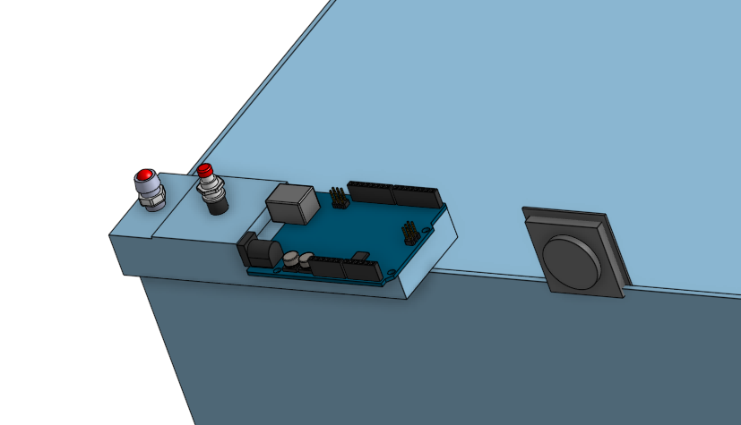

## ArduinoSousVide

### Psuedo Code
In Psuedocode.ino file
#### Description
The Psuedo code gives us a clear outline for the code, which will help greatly in the long run.

### Onshape Link
[Onshape Link](https://cvilleschools.onshape.com/documents/c3962513f441d4007ffeae5e/w/b6f45b338eec284bfbfb06f5/e/f69b6bea835e3a074534029c)
### Onshape Progress
I added a button to the assembly that would turn the tempature sensor on.
Also, I added a Led that would turn on when the tempature reached the desired heat.
I am not totally sure whether we will be able to finish on time or not.
### Picture of the Current Onshape

